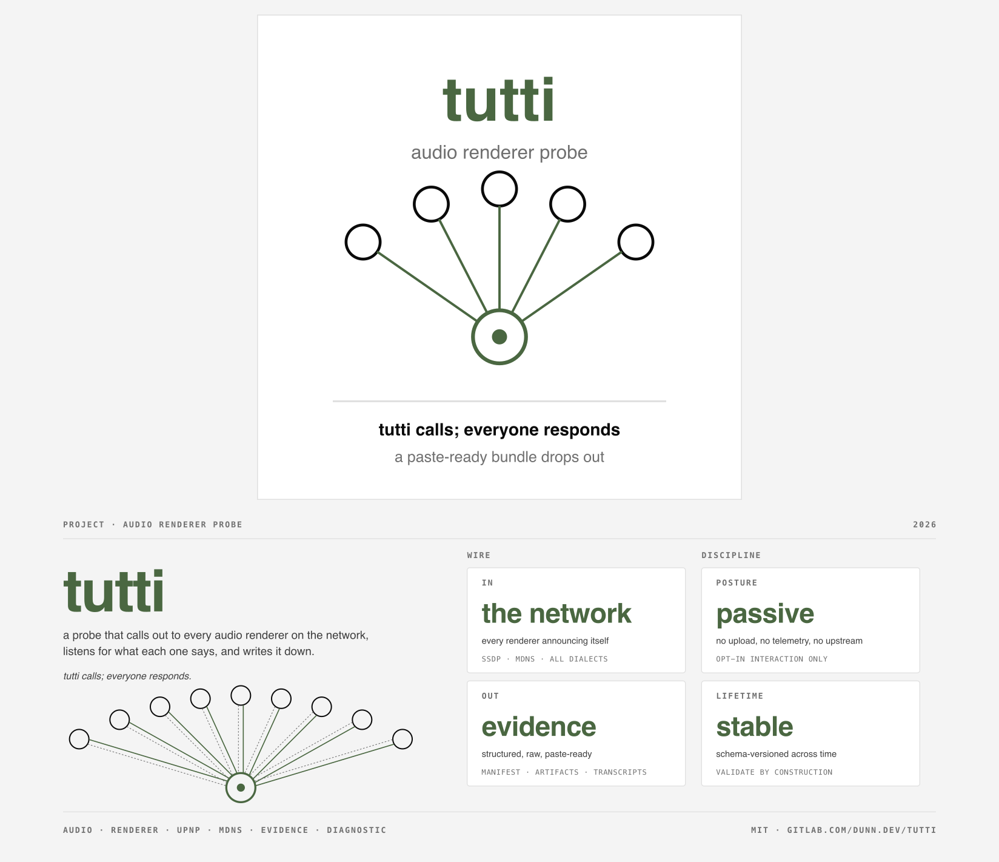

<p align="center"></p>

# tutti

[](https://gitlab.com/dunn.dev/tutti/-/pipelines)
[](https://gitlab.com/dunn.dev/tutti/-/releases/v0.1.0)
[](LICENSE)


> *Tutti*: an Italian musical direction. The conductor cues everyone in.

A single binary that asks every audio renderer on your LAN to announce
itself, catalogues the answers, and tells you what a Go control-point
app would see when it tried to use each device. Output is a directory
of JSON + raw artifacts, paste-ready for a bug report and ingested by
[tutti.dunn.dev][site] for the public corpus.

[site]: https://tutti.dunn.dev

## Why this exists

A UPnP renderer that doesn't show up in your music client is almost
always a parser mismatch, not a network problem. The device announces
itself fine; the client's library throws it away because the device's
descriptor doesn't match what the parser expected. Different libraries
throw away different devices.

tutti reproduces what a Go-based control-point app sees on the wire,
runs the descriptor through every Go UPnP library it knows about, and
records the accept/reject decision with a machine-readable reason
code. Run it, paste the output, the maintainer can see exactly where
the rejection happened.

This is most directly useful for clients built on `go-upnpcast` or
`huin/goupnp` (notably [supersonic][supersonic]). Apps in other
language stacks (JUPnP/Java, Symfonium's stack, Feishin's TS path)
benefit from the wire-level evidence but not from the library-decision
trace. Cross-language compare may come later if real cases demand it.

[supersonic]: https://github.com/dweymouth/supersonic

## What it captures

Per device on your LAN:

- **SSDP**: the M-SEARCH inputs (target, MX, ST list), every response
  (USN, ST, LOCATION, SERVER, BOOTID, CONFIGID, source `IP:port`), and
  per-USN grouping.
- **mDNS / DNS-SD**: every audio-renderer service type announced
  (`_airplay._tcp`, `_googlecast._tcp`, `_raop._tcp`,
  `_spotify-connect._tcp`, `_sonos._tcp`, etc.), with full TXT records.
- **Device descriptor**: raw XML and a parsed canonical form
  (deviceType, friendlyName, manufacturer, modelName, UDN, X_DLNADOC,
  icons, services list with SCPD/control/event URLs).
- **Library decisions**: for each Go UPnP control-point library tutti
  knows about (`go-upnpcast`, `huin/goupnp`), the accept/reject result
  with a machine-parseable reason code. v0 ships *reimplementations*
  of each library's parser (see `internal/decisions`), keyed as
  `<lib>@reimpl-of-<version>`. Real library invocation lands later;
  the schema field `decision.method` distinguishes
  `reimplementation` (today) from `library_call` (future).
- **GetProtocolInfo**: the device's Sink list (every MIME type it
  claims to accept), with derived counts per format class (DSD, MQA,
  FLAC, etc.). Drives discovery of the kind of bug that hides behind a
  device that *plays* a format but doesn't *announce* it.
- **Drive test** (opt-in via `--drive`): a real `SetAVTransportURI` +
  `Play` against test tones, with polled `GetTransportInfo` /
  `GetPositionInfo` capture. Format matrix is intersected with the
  device's `protocol_info` Sink list, so tutti only attempts formats
  the device claims to accept (PCM 44.1/48/96/192 kHz, FLAC at common
  rates, MP3, AAC, Opus). At v0 the tones are embedded in the binary
  and served from a transient local HTTP server tutti spins up on a
  random port; later versions will fetch from
  [tutti.dunn.dev/audio/](https://tutti.dunn.dev/audio/) for shared
  reproducibility. The tones are math-generated 5-second sine waves
  built by `scripts/gen-tones.sh`; MIT-licensed alongside the code,
  provenance fully owned.
- **Metadata on two surfaces** (per drive run):
  - **DIDL-Lite envelope** that tutti sends with `SetAVTransportURI`:
    title `"tutti probe: <format>@<rate>"`, artist `tutti.dunn.dev`,
    album `Audio Renderer Probes`. v0 omits `<upnp:albumArtURI>` (no
    cover art site yet); when tutti.dunn.dev/audio/covers/ exists,
    each scenario will reference a 300×300 PNG with `PROBE` and the
    format/rate overlaid.
  - **Embedded tags inside each test file** (ID3v2 for MP3, Vorbis
    comments for FLAC/Ogg, MP4 atoms for AAC/ALAC): title
    `"tutti embed: <format>@<rate>"`, artist `tutti.dunn.dev`, album
    `Audio Renderer Probes (embedded)`. Embedded artwork is a v1+
    addition.

  The two surfaces use *deliberately different* title prefixes
  (`probe` vs `embed`) so tutti can read `GetPositionInfo`'s
  `TrackMetaData` and derive which surface the device honored:
  `didl-lite`, `embedded`, `mixed`, or `none`. When cover art lands,
  devices that render it will show whichever card the device
  preferred on their display, adding a visible confirmation channel.

## Install

Pre-built binaries ship from the [releases page][rel]. Each release
includes per-binary cosign signatures, `.sha256` sidecars, CycloneDX
SBOMs, and SLSA v1.0 provenance attestations.

The full per-OS walkthrough lives at
[tutti.dunn.dev/contribute][contribute] (collapsible blocks for each
platform). The short form:

### macOS (Apple Silicon)

```sh
curl -LO https://gitlab.com/dunn.dev/tutti/-/releases/permalink/latest/downloads/tutti-darwin-arm64
chmod +x tutti-darwin-arm64
xattr -d com.apple.quarantine ./tutti-darwin-arm64
mv tutti-darwin-arm64 /usr/local/bin/tutti
```

The macOS binary is not yet code-signed; the `xattr` step is the
one-time unquarantine. A signed Homebrew tap is on the roadmap.

### Linux (amd64 or arm64)

```sh
curl -LO https://gitlab.com/dunn.dev/tutti/-/releases/permalink/latest/downloads/tutti-linux-amd64
# or tutti-linux-arm64 for ARM Linux
chmod +x tutti-linux-*
sudo mv tutti-linux-* /usr/local/bin/tutti
```

### Windows (amd64)

```powershell
Invoke-WebRequest `
  -Uri https://gitlab.com/dunn.dev/tutti/-/releases/permalink/latest/downloads/tutti-windows-amd64.exe `
  -OutFile tutti.exe
```

SmartScreen warns on first run; "More info" → "Run anyway" gets
through. Windows Firewall prompts the first time tutti binds for
SSDP/mDNS multicast — allow on private networks. Don't run inside
WSL: WSL networking is NAT'd and can't see host LAN devices.

### From source

```sh
git clone https://gitlab.com/dunn.dev/tutti.git
cd tutti
make build
```

Requires Go 1.25 or newer. ffmpeg is only required if you regenerate
the embedded test-tone matrix (`make gen-tones`); the matrix is
committed to the repo.

[rel]: https://gitlab.com/dunn.dev/tutti/-/releases
[contribute]: https://tutti.dunn.dev/contribute/

## Quickstart

```sh
# Walk the LAN passively.
tutti capture

# Same, plus a real cast against any UPnP renderer found.
tutti capture --drive

# Validate a capture directory against the schema before submitting.
tutti validate ./capture-2026-05-09T143022Z-myhost

# Output goes to ./capture-<timestamp>-<host>/.
# Review the directory, then submit it as a PR if you want to.
```

`tutti capture` does not touch any device. It listens for SSDP/mDNS
announcements, fetches device descriptors, and runs library-decision
analysis. Adding `--drive` does the AVTransport probe against
discovered UPnP renderers, serving test tones from a transient local
HTTP server tutti spins up on a random port (the tones are embedded
in the binary; no network round-trip required).

`--drive` calls `GetTransportInfo` once before any tones run. If the
device is `PLAYING` something at that moment, tutti refuses and
prints "device is in PLAYING state; pass `--drive --force` to
interrupt." Default behavior protects whoever might be listening.

Between tones, tutti emits `Stop` and waits briefly so the device is
in `STOPPED` before the next `SetAVTransportURI`. The whole tone
matrix runs in one pass without further intervention. Tutti also
emits a final `Stop` on the way out so the device isn't left parked
on a tutti tone after the run completes.

`tutti capture` writes manifests that pass `tutti validate` by
construction. You only run `tutti validate` directly to confirm a
hand-edited capture (e.g., after adding `notes.md` content or
adjusting a misclassified device tag) is still well-formed. CI runs
the same validator on every PR.

## What's in a capture

```
capture-2026-05-09T143022Z-andrewdunndev/
├── manifest.json                 # schema-versioned index, the renderer reads this
├── ssdp.json                     # parsed SSDP responses
├── ssdp-raw.txt                  # original wire dump
├── mdns.json                     # parsed mDNS records, all audio service types
├── devices/
│   └── eversolo-dmp-a6/          # one dir per device
│       ├── descriptor.xml        # raw, fetched
│       ├── descriptor.json       # parsed, canonical fields
│       ├── decisions.json        # per-library accept/reject + reason
│       ├── protocol-info.json    # parsed Sink list with derived counts
│       ├── protocol-info.txt     # raw GetProtocolInfo response
│       └── drive/                # only if --drive
│           ├── run-1-opus.log
│           ├── run-2-dsd64.log
│           └── run-3-dsd256.log
└── notes.md                      # writable by you, prose context
```

`manifest.json` is the load-bearing file. It's the single index the
public corpus renderer (tutti.dunn.dev) reads. Schema is at v1 and
versioned in every manifest. Old captures keep rendering when the
schema evolves.

The schema lives at [`schema/manifest.v1.json`](schema/manifest.v1.json)
as JSON Schema. That file is the source of truth. Everything
downstream is derived from it: tutti's Go validator, the renderer's
TypeScript types, the documentation example below, and the CI gate on
PRs. If the schema and any of those disagree, the schema is correct.

### manifest.json (schema v1, illustrative)

```json
{
  "schema_version": 1,
  "tutti_version": "0.1.0",
  "capture_id": "01HX7Z2FJK4Q3P9V8R5N6M2W3T",
  "captured_at": "2026-05-09T14:30:22Z",
  "contributor": "github:andrewdunndev",
  "host": { "os": "darwin", "arch": "arm64", "interfaces": ["en0"] },

  "scaninfo": {
    "ssdp_st_list": ["ssdp:all", "upnp:rootdevice",
                     "urn:schemas-upnp-org:device:MediaRenderer:1"],
    "ssdp_mx": 3,
    "mdns_service_types": ["_airplay._tcp", "_googlecast._tcp",
                           "_raop._tcp", "_spotify-connect._tcp"]
  },

  "runstats": {
    "elapsed_seconds": 12.4,
    "ssdp_responses": 9,
    "ssdp_unique_usns": 6,
    "mdns_records": 14,
    "exit": "success"
  },

  "redactions": ["client-ip", "device-ip", "auth-tokens",
                 "salt", "username", "lan-topology"],

  "devices": [
    {
      "slug": "eversolo-dmp-a6",
      "vendor": "EVERSOLO",
      "model": "DMP-A6 Master Gen 2",
      "firmware": "5.6.46-100",
      "udn": "uuid:800a805eef11-dmr",
      "tags": ["dlna", "discovery-ok", "drive-ok"],

      "discovery": {
        "ssdp_usns": ["uuid:800a805eef11-dmr",
                      "uuid:800a805eef11-dmr::upnp:rootdevice"],
        "mdns_services": []
      },

      "decisions": {
        "go-upnpcast@reimpl-of-v0.1.0": {
          "result": "accepted",
          "reason_code": "mediarenderer_v1_avtransport_found",
          "reason_text": "deviceType matched MediaRenderer:1; AVTransport, RenderingControl, ConnectionManager all parsed",
          "method": "library_call",
          "confidence": "high"
        },
        "huin/goupnp@reimpl-of-v1.3.0": {
          "result": "accepted",
          "reason_code": "device_with_av_transport",
          "reason_text": "...",
          "method": "library_call",
          "confidence": "high"
        }
      },

      "protocol_info": {
        "sink_count": 392,
        "audio_sink_count": 107,
        "format_matches": { "dsd": 0, "flac": 4, "mqa": null }
      },

      "drive_test": {
        "performed": true,
        "runs": [
          {
            "scenario": "flac-96k-24",
            "mime": "audio/flac",
            "rate_hz": 96000,
            "bits": 24,
            "metadata_didl_lite_sent": {
              "title": "tutti probe: FLAC 96k/24",
              "artist": "tutti.dunn.dev",
              "album": "Audio Renderer Probes",
              "art_url": "https://tutti.dunn.dev/audio/covers/probe-flac-96000-24.png"
            },
            "metadata_embedded": {
              "title": "tutti embed: FLAC 96k/24",
              "artist": "tutti.dunn.dev",
              "album": "Audio Renderer Probes (embedded)",
              "art_card": "embed-flac-96000-24.png"
            },
            "metadata_echoed": {
              "title": "tutti probe: FLAC 96k/24",
              "art_url": "https://tutti.dunn.dev/audio/covers/probe-flac-96000-24.png"
            },
            "metadata_source": "didl-lite",
            "metadata_round_trip": "matched",
            "art_fetch_observed": true,
            "result": "playing",
            "transitions": ["TRANSITIONING", "PLAYING"],
            "transcript_file": "devices/eversolo-dmp-a6/drive/run-1-flac-96k-24.log"
          }
        ]
      }
    }
  ]
}
```

`reason_code` is a controlled vocabulary; the renderer filters and
colors on it. `reason_text` is for humans reading the bug report.
`capture_id` is a ULID; cite it in upstream issues so the maintainer
can find the source-of-truth bundle.

A device entry must always have `discovery` (the SSDP/mDNS
announcements that surfaced it). Everything else (`decisions`,
`protocol_info`, `drive_test`, `descriptor`) is optional but at least
one must be present. This lets tutti record evidence for devices that
announce only on mDNS (AirPlay-only, Spotify-Connect-only) or whose
descriptor URL is unreachable, without dropping them from the
manifest.

### Schema migration policy

The schema is versioned independently of the binary. Within a
schema-major-version (v1.x):

- New fields are added as nullable. Older captures pass validation
  with the field absent.
- Existing fields' shapes are frozen. Their meanings are frozen.
- Derived fields (counts, classifications) can be added if they're
  computable from raw artifacts in the same capture, so old captures
  can be re-derived against new tutti versions.

A breaking change bumps the schema major version. The renderer keeps
parsers for every shipped major version. Old captures keep rendering.

### Validation rules beyond schema-shape

`tutti validate` rejects captures that are technically well-formed
JSON but don't actually capture anything useful. These rules catch the
case where the binary ran but a firewall, interface mismatch, or
permission issue meant nothing was captured:

- A capture with `runstats.ssdp_responses == 0` *and*
  `runstats.mdns_records == 0` is rejected. If your LAN really has
  zero devices announcing on either protocol, pass `--allow-empty` to
  acknowledge.
- A `devices[]` entry must have at least one entry in `decisions`.
  An empty `decisions` map means no library was actually invoked
  against the descriptor, which is a tutti bug, not a capture state.
- A `drive_test` with `performed: true` must have at least one entry
  in `runs[]`.
- A `redactions` array must be present unless `--no-redact` was set
  (and the manifest records that flag was set).

The renderer at tutti.dunn.dev applies the same validator before
rendering. A capture that doesn't pass shows the validation error,
not a partial render.

## Scope

### tutti does

- Walk SSDP and mDNS to inventory every audio renderer announcing on
  the LAN.
- Fetch and parse UPnP device descriptors.
- Run accept/reject analysis against the Go control-point libraries
  used by real apps (supersonic, etc.).
- Drive a real cast against UPnP renderers, when explicitly asked.
- Produce a paste-ready bundle that the public corpus can ingest and
  upstream maintainers can act on.

### tutti does not

- Cast Chromecast or AirPlay 2 streams. Both protocols are surfaced at
  the discovery layer; drive support is added per-protocol when real
  cases demand it.
- Implement Roon Ready, Squeezebox/SlimProto, MPD, or any
  closed/proprietary streaming protocol.
- Modify any device. Even `--drive` only sends standard UPnP
  AVTransport actions that the device itself documents as supported.
- Send anything to the network outside your LAN. No telemetry, no
  upload, no analytics.

## Privacy

Redaction is enforced by the schema, not by convention: a manifest
without a `redactions` array (or with `--no-redact` set without the
flag being recorded) fails validation and won't render. You can't get
the value (a published capture) without passing through the
redaction-recording step.

Captures are reviewed by you before submission. tutti also auto-scrubs
common PII at capture time:

- Subsonic/Navidrome auth tokens, salts, usernames in any URL it
  records.
- Authorization headers in any HTTP transcript.
- Your client IP, the device's LAN IP, and any other RFC 1918 address
  the capture happened to surface (replaced with `<CLIENT_IP>` /
  `<DEVICE_IP>`).

The device's UDN is *preserved on purpose*. It is the central piece of
parser-bug evidence, advertised in clear on every multicast, and is
not sensitive in isolation.

`--no-redact` exists for power users on isolated test networks who
want raw artifacts. The manifest records which redactions were
applied, so a reader of the bundle always knows what was stripped.

## Contributing a device

1. Run `tutti capture` (or `tutti capture --drive`) against your LAN.
2. Open the resulting directory; review the contents; edit `notes.md`
   if there's context worth adding ("the device is a few seconds slow
   to respond after wakeup," "I had Sonoma's firewall on and these
   ports were open," etc.).
3. Run `tutti validate <dir>` to self-check before submitting.
4. Open a merge request to `gitlab.com/dunn.dev/tutti` adding the
   directory under `evidence/<vendor>-<model>/captures/`. CI runs the
   same validator and rejects the MR with the same error you'd see
   locally if anything fails.
5. The site at [tutti.dunn.dev][site] picks up the merge and renders a
   page for the device with your capture in the history.

Anonymous contributions are accepted (set `contributor: null`). If you
include a `github:` or `gitlab:` handle, the rendered page links to
your forge profile.

## Library compare mode

```sh
tutti diff-libs --descriptor http://<DEVICE_IP>:1054/description.xml
```

Hands the same descriptor to every Go control-point library tutti
knows about. Reports where they diverge. Useful when you have a device
that one client sees and another doesn't.

## When things go wrong

tutti errors are written to name the next action, not just the
problem. Three examples:

```
$ tutti capture
Error: no SSDP responses received on any interface (en0, en1).
Suggested next step: re-run with `--interface <name>` to scan a
specific interface, or check that your firewall permits inbound
multicast on UDP/1900. Run `tutti capture --debug-network` to see the
raw socket setup.
```

```
$ tutti validate ./capture-2026-05-09T143022Z-myhost
Error: manifest.json is missing required field `devices[0].decisions`.
Suggested next step: this is a tutti bug, not a capture you can
hand-fix. Re-run `tutti capture` to regenerate. If it reproduces, file
the failing capture-id at https://gitlab.com/dunn.dev/tutti/-/issues.
```

```
$ tutti capture --drive
Error: descriptor fetch failed for eversolo-dmp-a6 after 3 attempts
(http://<DEVICE_IP>:1054/description.xml: connection refused).
Suggested next step: confirm the device is on (its UDN was advertised
2 seconds ago) and re-run. If the device is reachable but tutti
can't reach it, check the firewall on the host running tutti, or
pass `--interface <name>` to scan a specific NIC.
```

Network operations retry up to three times with exponential backoff
and then bail with a prescriptive error. Library decision calls do not
retry; they are deterministic against a fetched descriptor.

## Site

[tutti.dunn.dev][site] is the public corpus. Three things live there:

- [`/learn/`][learn]: long-form references — UPnP/DLNA protocols
  end to end, why streaming is finicky in practice, and an
  implementations catalog of 35 renderer stacks, libraries, clients,
  and bridges.
- [`/devices/`][devices]: every profiled device, with library
  decisions, format-support summary, drive transcripts, and capture
  history. Each device's page progressively discloses raw evidence.
- [`/contribute/`][contribute]: the per-OS install + capture +
  validate + submit walkthrough. Two submission paths (MR or issue),
  templates linked.

[learn]: https://tutti.dunn.dev/learn/
[devices]: https://tutti.dunn.dev/devices/

## Status

Versioned per [SemVer](https://semver.org/). Schema is independent of
the binary version and bumps only on breaking change.

| Item | State |
|---|---|
| SSDP discovery | shipped |
| mDNS discovery | shipped |
| UPnP descriptor parse | shipped |
| go-upnpcast decision trace | shipped (reimpl) |
| huin/goupnp decision trace | shipped (reimpl) |
| GetProtocolInfo capture | shipped |
| Drive test (UPnP AVTransport) | shipped |
| Real library invocation (vs reimpl) | not started |
| AirPlay drive | not started |
| Chromecast drive | not started |

Platforms with signed binaries: linux/amd64, linux/arm64, darwin/arm64,
windows/amd64. Source builds anywhere Go 1.25+ runs.

## Reference impl

`reference-impl/python/` contains a stdlib-only Python implementation
of the wire layer (SSDP probe, descriptor fetch, AVTransport drive).
~100 LoC each, no dependencies. Two purposes:

- **Legibility anchor**: anyone wary of a static binary from a small
  repo can read the Python in five minutes and verify the binary does
  the same thing on the wire.
- **Hack-quick path**: for one-off changes (different M-SEARCH
  timeout, different ST list), edit a Python script in place; no
  rebuild.

Origin of these scripts is the [narjo-eversolo-upnp][narjo] case
study, which produced the first device in this corpus.

[narjo]: https://gitlab.com/dunn.dev/narjo-eversolo-upnp

## Acknowledgments

- [`go-upnpcast`](https://github.com/supersonic-app/go-upnpcast) and
  [`huin/goupnp`](https://github.com/huin/goupnp) for being the
  control-point libraries this tool can usefully compare.
- [`alexballas/go2tv`](https://github.com/alexballas/go2tv) and
  [`dweymouth/supersonic`](https://github.com/dweymouth/supersonic)
  for being the apps that motivated the work.
- [Plutinosoft Platinum](https://github.com/plutinosoft/Platinum)
  whose SDK fingerprint shows up in capture #1 as the renderer-side
  software.

## License

[MIT](./LICENSE).
