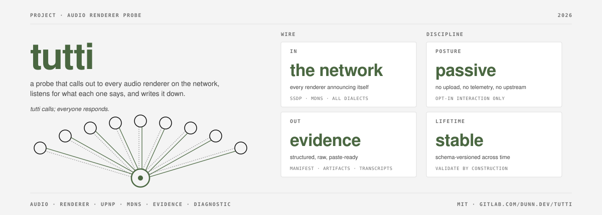

# tutti

[](https://gitlab.com/dunn.dev/tutti/-/pipelines)
[](https://gitlab.com/dunn.dev/tutti/-/releases/v0.1.0)
[](LICENSE)


> *Tutti*: an Italian musical direction. The conductor cues everyone in.

A single binary that asks every audio renderer on your LAN to announce
itself, catalogues the answers, and tells you what a Go control-point
app would see when it tried to use each device. Output is a directory
of JSON + raw artifacts, paste-ready for a bug report and ingested by
[tutti.dunn.dev][site] for the public corpus.

[site]: https://tutti.dunn.dev

## Why

A UPnP renderer that doesn't show up in your music client is almost
always a parser mismatch, not a network problem. The device announces
itself fine; the client's library throws it away because the
descriptor doesn't match what the parser expected. Different libraries
throw away different devices. tutti reproduces what a Go control-point
sees on the wire, runs the descriptor through every Go UPnP library it
knows about, and records the accept/reject decision with a
machine-readable reason code. Full background:
[tutti.dunn.dev/learn][learn].

[learn]: https://tutti.dunn.dev/learn/

## Install

Pre-built signed binaries (linux/amd64, linux/arm64, darwin/arm64,
windows/amd64) live on the [releases page][rel]. Per-OS walkthrough
with the one-time unquarantine / firewall notes:
[tutti.dunn.dev/contribute][contribute].

From source (Go 1.25+):

```sh
git clone https://gitlab.com/dunn.dev/tutti.git
cd tutti
make build
```

[rel]: https://gitlab.com/dunn.dev/tutti/-/releases
[contribute]: https://tutti.dunn.dev/contribute/

## Quickstart

```sh
# Walk the LAN passively.
tutti capture

# Same, plus a real cast against any UPnP renderer found.
tutti capture --drive

# Validate a capture directory against the schema.
tutti validate ./capture-2026-05-09T143022Z-myhost
```

`tutti capture` does not touch any device. Adding `--drive` does an
AVTransport probe against discovered UPnP renderers, serving embedded
test tones from a transient local HTTP server. If a device is already
`PLAYING`, tutti refuses unless `--force` is passed. Output lands in
`./capture-<timestamp>-<host>/`.

## What you get

Per device on your LAN, the capture records:

- **SSDP + mDNS** announcements (raw and parsed, all audio service types).
- **Device descriptor** (raw XML + canonical fields).
- **Library decisions** (`go-upnpcast`, `huin/goupnp`): accept/reject
  with a machine-parseable reason code.
- **GetProtocolInfo** Sink list with derived counts per format class.
- **Drive transcripts** (only with `--drive`): metadata round-trip
  recorded on two surfaces (DIDL-Lite envelope vs embedded tags), with
  `transcript_file` per scenario.

Schema: [`schema/manifest.v1.json`](schema/manifest.v1.json) is the
source of truth. The Go validator, the renderer's TypeScript types,
and the CI gate are all derived from it.

## Scope

tutti **does**: walk SSDP/mDNS, fetch and parse UPnP descriptors, run
accept/reject analysis against Go control-point libraries, drive a
real cast when asked, produce a paste-ready bundle.

tutti **does not**: cast Chromecast or AirPlay 2 streams (surfaced at
discovery only); implement Roon Ready, SlimProto, MPD, or any
closed/proprietary streaming protocol; modify any device; send
anything outside your LAN.

## Privacy

Redaction is enforced by the schema, not by convention: a manifest
without a `redactions` array fails validation and won't render. tutti
auto-scrubs Subsonic/Navidrome tokens, salts, usernames, Authorization
headers, and client/device LAN IPs at capture time. The device UDN is
preserved on purpose: it's the central piece of parser-bug evidence,
advertised in clear on every multicast.

## Contributing a device

1. Run `tutti capture` (or `tutti capture --drive`).
2. Review the directory, edit `notes.md` if context helps.
3. `tutti validate <dir>` self-checks before submitting.
4. Open an MR adding the directory under
   `evidence/<vendor>-<model>/captures/`. CI runs the same validator.
5. [tutti.dunn.dev][site] picks up the merge and renders a page for
   the device with your capture in the history.

Anonymous contributions accepted (`contributor: null`). Submission
walkthrough with templates: [tutti.dunn.dev/contribute][contribute].

## Site

[tutti.dunn.dev][site] is the public corpus and the progressive
disclosure surface for everything not in this README:

- [`/learn/`][learn]: protocol references, why streaming is finicky,
  and a 35-stack implementations catalog.
- [`/devices/`][devices]: every profiled device with library
  decisions, format-support summary, drive transcripts, capture
  history.
- [`/contribute/`][contribute]: per-OS install + capture + validate +
  submit walkthrough.

[devices]: https://tutti.dunn.dev/devices/

## Status

Versioned per [SemVer](https://semver.org/). Schema is independent of
the binary and bumps only on breaking change.

| Item | State |
|---|---|
| SSDP / mDNS discovery | shipped |
| UPnP descriptor parse | shipped |
| go-upnpcast / huin-goupnp decision trace | shipped (reimpl) |
| GetProtocolInfo capture | shipped |
| Drive test (UPnP AVTransport) | shipped |
| Real library invocation (vs reimpl) | not started |
| AirPlay / Chromecast drive | not started |

## Reference impl

`reference-impl/python/` contains a stdlib-only Python port of the
wire layer (~100 LoC each, no deps). Two purposes: legibility anchor
for anyone wary of a static binary, and a hack-quick path for one-off
changes. Origin: the [narjo-eversolo-upnp][narjo] case study, which
produced the first device in this corpus.

[narjo]: https://gitlab.com/dunn.dev/narjo-eversolo-upnp

## Acknowledgments

[`go-upnpcast`](https://github.com/supersonic-app/go-upnpcast) and
[`huin/goupnp`](https://github.com/huin/goupnp) for being the
control-point libraries this tool can usefully compare.
[`alexballas/go2tv`](https://github.com/alexballas/go2tv) and
[`dweymouth/supersonic`](https://github.com/dweymouth/supersonic) for
being the apps that motivated the work.
[Plutinosoft Platinum](https://github.com/plutinosoft/Platinum) whose
SDK fingerprint shows up in capture #1 as the renderer-side software.

## License

[MIT](./LICENSE).
